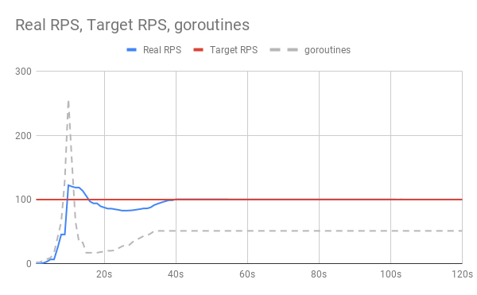
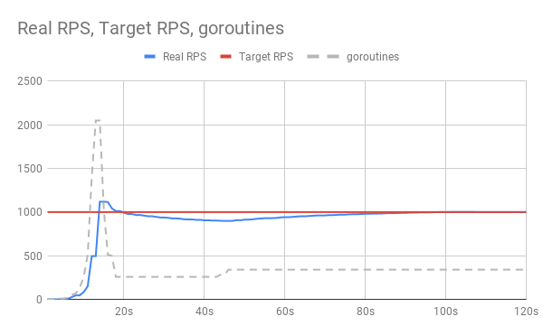

# Artemis

[](https://golangci.com)
[](LICENSE.txt)

Artemis is a library which dynamically resize the amount of workers (goroutines)
to run functions in parallel at your target rate.

## Installation

```shell
$ go get -u github.com/RY-2718/artemis
```

## Usage

```go
package main

import (
	"context"
	"fmt"
	"runtime"
	"time"

	"github.com/RY-2718/artemis"
)

func main() {
	// Define the function to run
	f := func() {
		time.Sleep(300 * time.Millisecond)
	}
	
	// Define the rate (frequency, error rate)
	rate := artemis.Rate{
		Freq:      100,
		Per:       time.Second, // Set `Per` param as time.Second now
		ErrorRate: 0.1,
	}

	ctx := context.Background()
	// Runner has responsibility for running function and reporting stats
	runner := artemis.Runner{}

	go runner.RunWithRate(ctx, &rate, f)

    // If you want to report periodically, using Ticker is a solution
	ticker := time.NewTicker(1 * time.Second)
	for {
		select {
		case <-ticker.C:
			// runner.Report() returns a struct which have RPS (rate per second), TargetRPS
			r := runner.Report()
			fmt.Printf("%f, %f, %d\n", r.RPS, r.TargetRPS, runtime.NumGoroutine())
		}
	}
}
```

## Performance

Here we show the performance of Artemis at [100, 1000] rps (rate per second).

Artemis increases workers exponentially at first, 
and decreases them by half when rps exceeds target rps, 
then increases again when rps gets below the target.





## License

MIT
